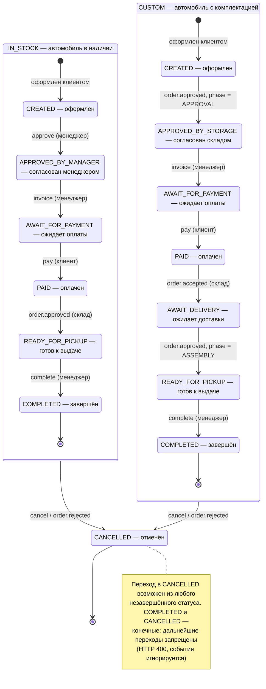
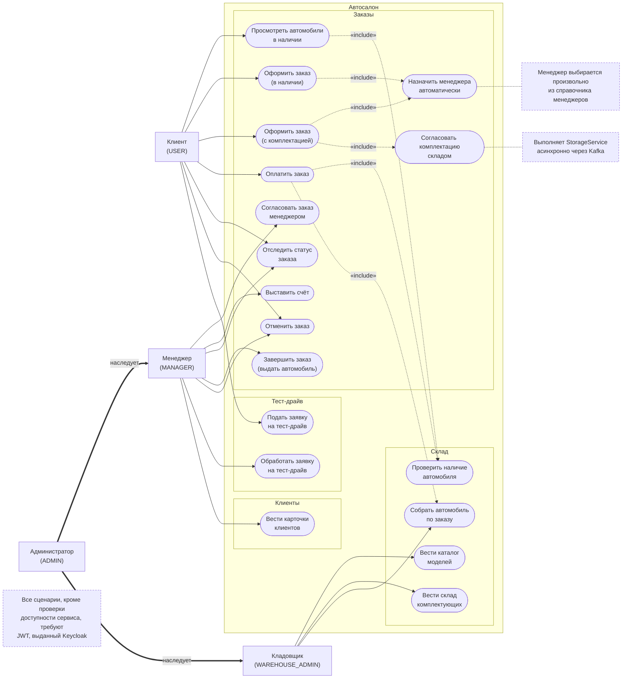
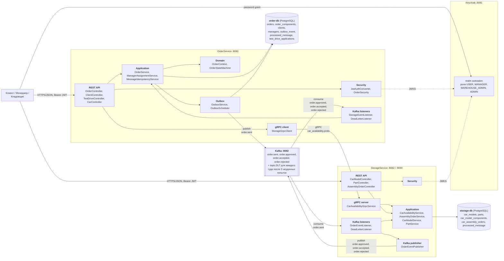
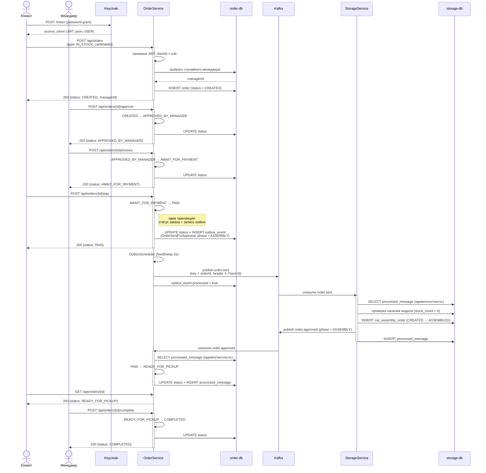
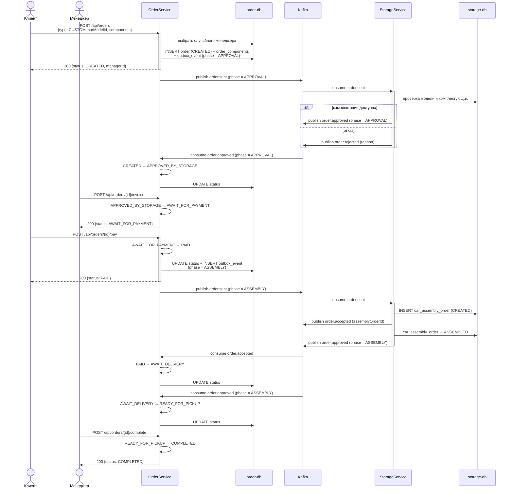
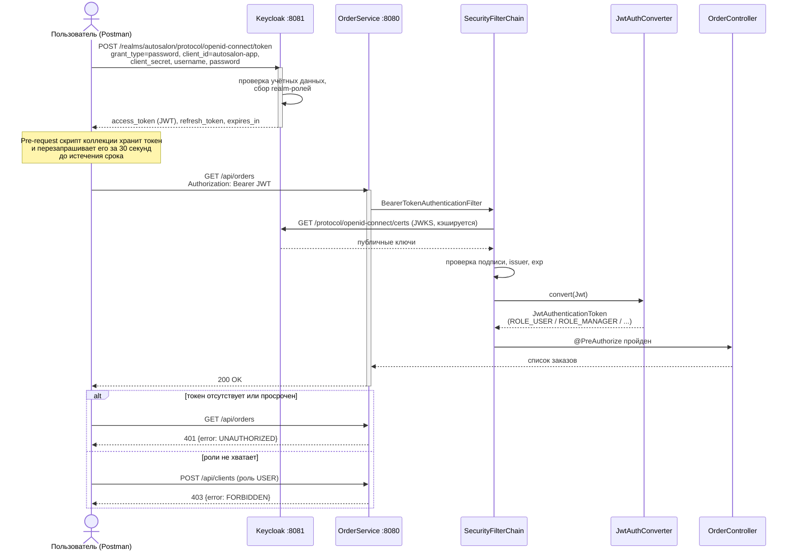
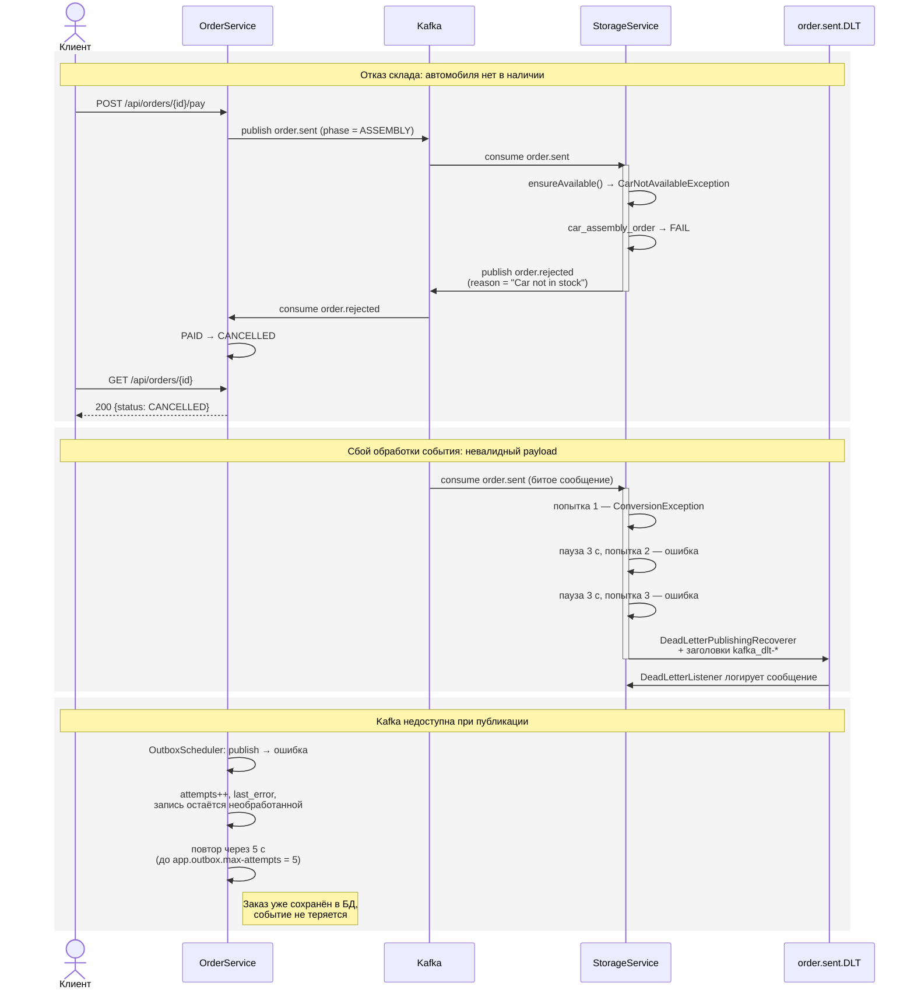

# Autosalon — архитектура автосалона

Два микросервиса на Spring Boot: оформление и сопровождение заказов на автомобили — из наличия
и с индивидуальной комплектацией, заявки на тест-драйв — и складской учёт моделей, комплектующих
и сборки. Синхронно сервисы общаются по gRPC, асинхронно — через Kafka.

Стек: Spring Boot 3.2 (Java 17), PostgreSQL + Liquibase, Kafka, gRPC, Keycloak, Docker Compose.

**2** сервиса · **2** базы PostgreSQL · **4** топика + DLT · **9** статусов заказа · **4** роли Keycloak · **93** теста

## Содержание

1. [Состав системы](#1-состав-системы)
2. [Как сервисы общаются](#2-как-сервисы-общаются)
3. [Заказ и его статусы](#3-заказ-и-его-статусы)
4. [Диаграммы](#4-диаграммы)
5. [Надёжность обмена](#5-надёжность-обмена)
6. [Роли и доступ](#6-роли-и-доступ)
7. [API](#7-api)
8. [Запуск и токен](#8-запуск-и-токен)

## 1. Состав системы

| Компонент | Технология | Порт | Назначение |
|---|---|---|---|
| **OrderService** | Spring Boot 3.2, Java 17 | `8080` | Клиенты, заказы, тест-драйвы, конечный автомат статусов заказа, transactional outbox |
| **StorageService** | Spring Boot 3.2, Java 17 | `8082` (HTTP), `9090` (gRPC) | Модели автомобилей, комплектующие, сборочные заказы, проверка наличия |
| **order-db · storage-db** | PostgreSQL 15 | `5432` · `5433` | По собственной базе на сервис (database per service) |
| **Kafka** | confluentinc/cp-kafka 7.6, режим KRaft | `9092` | Доменные события между сервисами |
| **Kafka UI** | provectuslabs/kafka-ui | `8090` | Просмотр топиков, сообщений и consumer-групп |
| **Keycloak** | quay.io/keycloak 24, realm `autosalon` | `8081` | OAuth2 / OIDC, выдача JWT, роли |

Схема БД в обоих сервисах создаётся Liquibase, миграции лежат в `src/main/resources/changelog`.

## 2. Как сервисы общаются

* **gRPC — когда ответ нужен сразу.** OrderService спрашивает у склада список доступных автомобилей
  в рамках HTTP-запроса пользователя (`CarAvailabilityService.ListAvailableCars`, `GetAvailableCar`).
  Контракт — `src/main/proto/car_availability.proto`.
* **Kafka — когда операция длительная.** Согласование комплектации, сборка и резервирование
  автомобиля. Пользователь не ждёт: заказ меняет статус по мере прихода событий.
* **REST + JWT — наружу.** Внешний API обоих сервисов. Токен выдаёт Keycloak, сервисы проверяют
  подпись по JWKS и достают роли из `realm_access`.

### Топики Kafka

| Топик | Направление | Событие | Смысл |
|---|---|---|---|
| `order.sent` | Order → Storage | `OrderSentForApprovalEvent` | Запрос согласования комплектации (`phase=APPROVAL`) или запрос сборки и резерва (`phase=ASSEMBLY`) |
| `order.approved` | Storage → Order | `OrderApprovedEvent` (`phase`) | Комплектация согласована либо автомобиль готов |
| `order.accepted` | Storage → Order | `OrderAcceptedEvent` | Сборочный заказ принят в работу |
| `order.rejected` | Storage → Order | `OrderRejectedEvent` (`reason`) | Отказ склада с причиной |
| `<topic>.DLT` | — | — | Сообщение после трёх неудачных попыток обработки, с заголовками `kafka_dlt-*` |

## 3. Заказ и его статусы

Заказ (`orders`) связан с:

* **клиентом** — `client_id`, идентификатор пользователя из Keycloak (`sub` токена);
* **менеджером** — `manager_id`, назначается **автоматически и произвольно** из справочника
  `managers` при оформлении заказа (`ManagerAssignmentService`);
* **автомобилем** — `car_model_id`, а для заказа с комплектацией ещё и таблица `order_components`
  (тип компонента → идентификатор детали).

Переходы описаны в `OrderStateMachine` и проверяются при каждом изменении. Два маршрута и общий переход в отмену:



> **CANCELLED** — из любого незавершённого статуса: по запросу клиента или менеджера либо при отказе
> склада. `COMPLETED` и `CANCELLED` конечные: попытка перехода из них возвращает 400, а событие
> с недопустимым переходом игнорируется и пишется в лог (предупреждение).

### Кто и чем двигает заказ

| Статус | Смысл | Инициатор | Действие |
|---|---|---|---|
| `CREATED` | Оформлен | клиент | `POST /api/orders` |
| `APPROVED_BY_MANAGER` | Согласован менеджером, только `IN_STOCK` | назначенный менеджер | `POST /api/orders/{id}/approve` |
| `APPROVED_BY_STORAGE` | Согласован складом, только `CUSTOM` | StorageService | `order.approved`, `phase=APPROVAL` |
| `AWAIT_FOR_PAYMENT` | Ожидает оплаты | назначенный менеджер | `POST /api/orders/{id}/invoice` |
| `PAID` | Оплачен, публикуется `order.sent` с `phase=ASSEMBLY` | клиент | `POST /api/orders/{id}/pay` |
| `AWAIT_DELIVERY` | Ожидает доставки автомобиля, только `CUSTOM` | StorageService | `order.accepted` |
| `READY_FOR_PICKUP` | Автомобиль готов к выдаче | StorageService | `order.approved`, `phase=ASSEMBLY` |
| `COMPLETED` | Завершён | назначенный менеджер | `POST /api/orders/{id}/complete` |
| `CANCELLED` | Отменён | клиент, менеджер, склад | `POST /api/orders/{id}/cancel` · `order.rejected` |

## 4. Диаграммы

### 4.1. Варианты использования

Роли и сценарии. Администратор наследует права менеджера и кладовщика.



### 4.2. Компоненты

Внутреннее устройство сервисов и связи между ними: REST, gRPC, Kafka, JDBC, JWKS.



### 4.3. Покупка автомобиля в наличии (`IN_STOCK`)

От получения токена до выдачи автомобиля, с outbox и идемпотентной обработкой событий.



### 4.4. Покупка автомобиля с комплектацией (`CUSTOM`)

Согласование складом до оплаты, сборка и доставка после.



### 4.5. Аутентификация

Password grant, проверка подписи по JWKS, роли и ответы 401 / 403.



### 4.6. Отказы и сбои

Отказ склада, три попытки обработки и DLT, недоступность Kafka при публикации.



## 5. Надёжность обмена

* **Transactional outbox.** Событие пишется в `outbox_event` в одной транзакции с изменением заказа.
  Планировщик публикует его в Kafka и помечает обработанным; при ошибке растит счётчик попыток
  до `app.outbox.max-attempts`.
* **Идемпотентность потребителя.** Таблица `processed_message` хранит `event_id`. Повторная доставка
  того же события не меняет статус заказа во второй раз.
* **Повторы и DLT.** Три попытки с паузой 3 секунды, затем `DeadLetterPublishingRecoverer` отправляет
  сообщение в `<topic>.DLT` вместе с заголовками с описанием ошибки. Слушатель DLT читает сырую
  строку, поэтому сам не падает на битом payload, и логирует сообщение.
* **Сквозной traceId.** Заголовок `X-Trace-Id` в HTTP, метаданных gRPC и заголовках Kafka попадает
  в MDC и в каждую строку лога обоих сервисов.

## 6. Роли и доступ

Роли realm `autosalon`: `USER`, `MANAGER`, `WAREHOUSE_ADMIN`, `ADMIN`.

| Действие | Кто может |
|---|---|
| Оформить заказ, оплатить, отменить свой заказ | `USER` (владелец) · `MANAGER` · `ADMIN` |
| Согласовать заказ, выставить счёт, завершить заказ | назначенный менеджер заказа · `ADMIN` |
| Видеть все заказы | `MANAGER` · `ADMIN` |
| Карточки клиентов (CRUD) | `MANAGER` · `ADMIN` |
| Модели, комплектующие, сборочные заказы | `WAREHOUSE_ADMIN` · `ADMIN` |
| Health, Swagger | без аутентификации |

Проверки — `@PreAuthorize` на контроллерах и сервисах; принадлежность заказа клиенту и назначенному
менеджеру проверяет бин `orderSecurity` (`isOwner`, `isAssignedManager`).

## 7. API

### OrderService (`http://localhost:8080`)

| Метод | Путь | Описание |
|---|---|---|
| `GET` | `/api/v1/health` | Состояние сервиса, БД и gRPC-связи со складом |
| `POST` | `/api/orders` | Оформить заказ: назначается менеджер, статус `CREATED` |
| `GET` | `/api/orders` | Список заказов: клиент видит только свои |
| `GET` | `/api/orders/{id}` | Заказ по идентификатору |
| `POST` | `/api/orders/{id}/approve` | Согласовать менеджером |
| `POST` | `/api/orders/{id}/invoice` | Выставить счёт |
| `POST` | `/api/orders/{id}/pay` | Оплатить, публикуется запрос складу |
| `POST` | `/api/orders/{id}/complete` | Завершить: автомобиль выдан |
| `POST` | `/api/orders/{id}/cancel` | Отменить |
| `DELETE` | `/api/orders/{id}` | Удалить |
| `POST` | `/api/clients` | Создать клиента |
| `GET/POST/DELETE` | `/api/test_drives` | Заявки на тест-драйв |
| `GET` | `/api/v1/cars`, `/api/v1/cars/{id}` | Автомобили в наличии (данные склада по gRPC) |

### StorageService (`http://localhost:8082`)

| Метод | Путь | Описание |
|---|---|---|
| `GET` | `/api/v1/health` | Состояние сервиса и БД |
| `GET/POST/DELETE` | `/api/car-models` | Модели автомобилей, фильтры: `brand`, `model`, `minPrice`, `maxPrice`, `bodyType`, `fuelType`, `gearBox`, `driveType`, `color`, `inStockOnly`, `component[WHEEL]=<uuid>` |
| `GET/POST/DELETE` | `/api/parts` | Комплектующие |
| `GET/POST/PUT/DELETE` | `/api/assembly-orders` | Сборочные заказы |

Swagger UI — на `/swagger-ui.html` обоих сервисов.

## 8. Запуск и токен

```bash
./gradlew :OrderService:bootJar :StorageService:bootJar
docker compose up -d --build
```

| Сервис | Адрес |
|---|---|
| OrderService | http://localhost:8080 (Swagger: `/swagger-ui.html`) |
| StorageService | http://localhost:8082 (Swagger: `/swagger-ui.html`), gRPC 9090 |
| Keycloak | http://localhost:8081 (admin/admin), realm `autosalon` |
| Kafka UI | http://localhost:8090 |

Realm Keycloak импортируется автоматически из `keycloak/realm-autosalon.json`. Пользователи
(логин = пароль): `admin`, `manager`, `manager2`, `manager3`, `warehouse`, `user`.

Получение токена:

```bash
curl -X POST http://localhost:8081/realms/autosalon/protocol/openid-connect/token \
  -d grant_type=password -d client_id=autosalon-app -d client_secret=autosalon-secret \
  -d username=user -d password=user
```

### Postman

Импортировать `postman/Autosalon.postman_collection.json` и `postman/Autosalon.postman_environment.json`.
То же, что `curl` выше, делает pre-request скрипт коллекции: токен запрашивается сам и обновляется
за 30 секунд до истечения, роль переключается запросами `Token: admin | manager | warehouse | user`
в папке `Auth`.

### Тесты

```bash
./gradlew test
```

Интеграционные тесты поднимают PostgreSQL через Testcontainers, поэтому нужен запущенный Docker.
